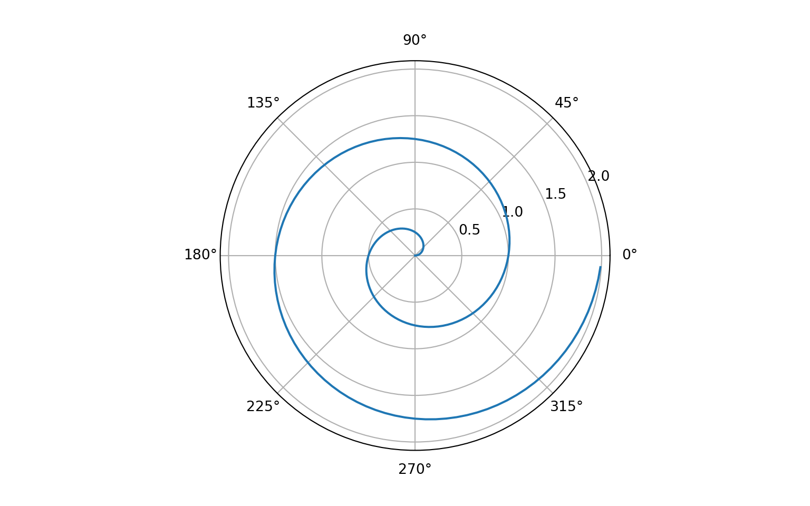

<link href="index_files/libs/htmltools-fill-0.5.8.1/fill.css" rel="stylesheet" />
<script src="index_files/libs/htmlwidgets-1.6.4/htmlwidgets.js"></script>
<script src="index_files/libs/plotly-binding-4.10.4/plotly.js"></script>
<script src="index_files/libs/typedarray-0.1/typedarray.min.js"></script>
<script src="index_files/libs/jquery-3.6.0/jquery-3.6.0.min.js"></script>
<link href="index_files/libs/crosstalk-1.2.1/css/crosstalk.min.css" rel="stylesheet" />
<script src="index_files/libs/crosstalk-1.2.1/js/crosstalk.min.js"></script>
<link href="index_files/libs/plotly-htmlwidgets-css-2.11.1/plotly-htmlwidgets.css" rel="stylesheet" />
<script src="index_files/libs/plotly-main-2.11.1/plotly-latest.min.js"></script>
<link href="index_files/libs/leaflet-1.3.1/leaflet.css" rel="stylesheet" />
<script src="index_files/libs/leaflet-1.3.1/leaflet.js"></script>
<link href="index_files/libs/leafletfix-1.0.0/leafletfix.css" rel="stylesheet" />
<script src="index_files/libs/proj4-2.6.2/proj4.min.js"></script>
<script src="index_files/libs/Proj4Leaflet-1.0.1/proj4leaflet.js"></script>
<link href="index_files/libs/rstudio_leaflet-1.3.1/rstudio_leaflet.css" rel="stylesheet" />
<script src="index_files/libs/leaflet-binding-2.2.3/leaflet.js"></script>


> Quarto format(`.qmd`)을 통한 블로그 포스팅이 가능한지 여부 파악
> 기존 `.Rmd`, `.Rmarkdown` 포맷으로만 가능하다고 생각했던 블로그 포스팅에 `.qmd`를 통해서도 가능한지 여부 테스트 진행

# Code test

## R

### plotly(Gapminder)

``` r
library(gapminder)
library(ggplot2)
library(plotly)

g <- gapminder %>% 
  filter(year == 2007) %>% 
  ggplot(aes(x = gdpPercap, y = lifeExp, color = continent, size = pop, ids = country)) +
  geom_point(alpha = 0.5) +
  ggtitle("Life expectancy versus GDP, 2007") +
  xlab("GDP per capita (US$)") +
  ylab("Life expectancy (years)") +
  scale_color_discrete(name = "Continent") +
  scale_size_continuous(name = "Population") + 
  theme_bw()

ggplotly(g)
```

<div class="plotly html-widget html-fill-item" id="htmlwidget-6465b2bca964ad2b4027" style="width:768px;height:480px;"></div>
<script type="application/json" data-for="htmlwidget-6465b2bca964ad2b4027">{"x":{"data":[{"x":[6223.3674650000003,4797.2312670000001,1441.2848730000001,12569.851769999999,1217.0329939999999,430.07069159999998,2042.0952400000001,706.01653699999997,1704.0637240000001,986.14787920000003,277.55185870000003,3632.5577979999998,1544.7501119999999,2082.4815669999998,5581.1809979999998,12154.089749999999,641.36952359999998,690.80557590000001,13206.48452,752.74972649999995,1327.6089099999999,942.6542111,579.23174300000005,1463.249282,1569.3314419999999,414.5073415,12057.49928,1044.7701259999999,759.34991009999999,1042.581557,1803.151496,10956.991120000001,3820.1752299999998,823.68562050000003,4811.0604290000001,619.67689240000004,2013.9773049999999,7670.122558,863.08846389999997,1598.4350890000001,1712.4721360000001,862.54075609999995,926.14106830000003,9269.6578079999999,2602.3949950000001,4513.4806429999999,1107.482182,882.96994380000001,7092.9230250000001,1056.3801209999999,1271.211593,469.70929810000001],"y":[72.301000000000002,42.731000000000002,56.728000000000002,50.728000000000002,52.295000000000002,49.579999999999998,50.43,44.741,50.651000000000003,65.152000000000001,46.462000000000003,55.322000000000003,48.328000000000003,54.790999999999997,71.337999999999994,51.579000000000001,58.039999999999999,52.947000000000003,56.734999999999999,59.448,60.021999999999998,56.006999999999998,46.387999999999998,54.109999999999999,42.591999999999999,45.677999999999997,73.951999999999998,59.442999999999998,48.302999999999997,54.466999999999999,64.164000000000001,72.801000000000002,71.164000000000001,42.082000000000001,52.905999999999999,56.866999999999997,46.859000000000002,76.441999999999993,46.241999999999997,65.528000000000006,63.061999999999998,42.567999999999998,48.158999999999999,49.338999999999999,58.555999999999997,39.613,52.517000000000003,58.420000000000002,73.923000000000002,51.542000000000002,42.384,43.487000000000002],"text":["gdpPercap:  6223.3675<br />lifeExp: 72.301<br />continent: Africa<br />pop:   33333216<br />country: Algeria","gdpPercap:  4797.2313<br />lifeExp: 42.731<br />continent: Africa<br />pop:   12420476<br />country: Angola","gdpPercap:  1441.2849<br />lifeExp: 56.728<br />continent: Africa<br />pop:    8078314<br />country: Benin","gdpPercap: 12569.8518<br />lifeExp: 50.728<br />continent: Africa<br />pop:    1639131<br />country: Botswana","gdpPercap:  1217.0330<br />lifeExp: 52.295<br />continent: Africa<br />pop:   14326203<br />country: Burkina Faso","gdpPercap:   430.0707<br />lifeExp: 49.580<br />continent: Africa<br />pop:    8390505<br />country: Burundi","gdpPercap:  2042.0952<br />lifeExp: 50.430<br />continent: Africa<br />pop:   17696293<br />country: Cameroon","gdpPercap:   706.0165<br />lifeExp: 44.741<br />continent: Africa<br />pop:    4369038<br />country: Central African Republic","gdpPercap:  1704.0637<br />lifeExp: 50.651<br />continent: Africa<br />pop:   10238807<br />country: Chad","gdpPercap:   986.1479<br />lifeExp: 65.152<br />continent: Africa<br />pop:     710960<br />country: Comoros","gdpPercap:   277.5519<br />lifeExp: 46.462<br />continent: Africa<br />pop:   64606759<br />country: Congo, Dem. Rep.","gdpPercap:  3632.5578<br />lifeExp: 55.322<br />continent: Africa<br />pop:    3800610<br />country: Congo, Rep.","gdpPercap:  1544.7501<br />lifeExp: 48.328<br />continent: Africa<br />pop:   18013409<br />country: Cote d'Ivoire","gdpPercap:  2082.4816<br />lifeExp: 54.791<br />continent: Africa<br />pop:     496374<br />country: Djibouti","gdpPercap:  5581.1810<br />lifeExp: 71.338<br />continent: Africa<br />pop:   80264543<br />country: Egypt","gdpPercap: 12154.0897<br />lifeExp: 51.579<br />continent: Africa<br />pop:     551201<br />country: Equatorial Guinea","gdpPercap:   641.3695<br />lifeExp: 58.040<br />continent: Africa<br />pop:    4906585<br />country: Eritrea","gdpPercap:   690.8056<br />lifeExp: 52.947<br />continent: Africa<br />pop:   76511887<br />country: Ethiopia","gdpPercap: 13206.4845<br />lifeExp: 56.735<br />continent: Africa<br />pop:    1454867<br />country: Gabon","gdpPercap:   752.7497<br />lifeExp: 59.448<br />continent: Africa<br />pop:    1688359<br />country: Gambia","gdpPercap:  1327.6089<br />lifeExp: 60.022<br />continent: Africa<br />pop:   22873338<br />country: Ghana","gdpPercap:   942.6542<br />lifeExp: 56.007<br />continent: Africa<br />pop:    9947814<br />country: Guinea","gdpPercap:   579.2317<br />lifeExp: 46.388<br />continent: Africa<br />pop:    1472041<br />country: Guinea-Bissau","gdpPercap:  1463.2493<br />lifeExp: 54.110<br />continent: Africa<br />pop:   35610177<br />country: Kenya","gdpPercap:  1569.3314<br />lifeExp: 42.592<br />continent: Africa<br />pop:    2012649<br />country: Lesotho","gdpPercap:   414.5073<br />lifeExp: 45.678<br />continent: Africa<br />pop:    3193942<br />country: Liberia","gdpPercap: 12057.4993<br />lifeExp: 73.952<br />continent: Africa<br />pop:    6036914<br />country: Libya","gdpPercap:  1044.7701<br />lifeExp: 59.443<br />continent: Africa<br />pop:   19167654<br />country: Madagascar","gdpPercap:   759.3499<br />lifeExp: 48.303<br />continent: Africa<br />pop:   13327079<br />country: Malawi","gdpPercap:  1042.5816<br />lifeExp: 54.467<br />continent: Africa<br />pop:   12031795<br />country: Mali","gdpPercap:  1803.1515<br />lifeExp: 64.164<br />continent: Africa<br />pop:    3270065<br />country: Mauritania","gdpPercap: 10956.9911<br />lifeExp: 72.801<br />continent: Africa<br />pop:    1250882<br />country: Mauritius","gdpPercap:  3820.1752<br />lifeExp: 71.164<br />continent: Africa<br />pop:   33757175<br />country: Morocco","gdpPercap:   823.6856<br />lifeExp: 42.082<br />continent: Africa<br />pop:   19951656<br />country: Mozambique","gdpPercap:  4811.0604<br />lifeExp: 52.906<br />continent: Africa<br />pop:    2055080<br />country: Namibia","gdpPercap:   619.6769<br />lifeExp: 56.867<br />continent: Africa<br />pop:   12894865<br />country: Niger","gdpPercap:  2013.9773<br />lifeExp: 46.859<br />continent: Africa<br />pop:  135031164<br />country: Nigeria","gdpPercap:  7670.1226<br />lifeExp: 76.442<br />continent: Africa<br />pop:     798094<br />country: Reunion","gdpPercap:   863.0885<br />lifeExp: 46.242<br />continent: Africa<br />pop:    8860588<br />country: Rwanda","gdpPercap:  1598.4351<br />lifeExp: 65.528<br />continent: Africa<br />pop:     199579<br />country: Sao Tome and Principe","gdpPercap:  1712.4721<br />lifeExp: 63.062<br />continent: Africa<br />pop:   12267493<br />country: Senegal","gdpPercap:   862.5408<br />lifeExp: 42.568<br />continent: Africa<br />pop:    6144562<br />country: Sierra Leone","gdpPercap:   926.1411<br />lifeExp: 48.159<br />continent: Africa<br />pop:    9118773<br />country: Somalia","gdpPercap:  9269.6578<br />lifeExp: 49.339<br />continent: Africa<br />pop:   43997828<br />country: South Africa","gdpPercap:  2602.3950<br />lifeExp: 58.556<br />continent: Africa<br />pop:   42292929<br />country: Sudan","gdpPercap:  4513.4806<br />lifeExp: 39.613<br />continent: Africa<br />pop:    1133066<br />country: Swaziland","gdpPercap:  1107.4822<br />lifeExp: 52.517<br />continent: Africa<br />pop:   38139640<br />country: Tanzania","gdpPercap:   882.9699<br />lifeExp: 58.420<br />continent: Africa<br />pop:    5701579<br />country: Togo","gdpPercap:  7092.9230<br />lifeExp: 73.923<br />continent: Africa<br />pop:   10276158<br />country: Tunisia","gdpPercap:  1056.3801<br />lifeExp: 51.542<br />continent: Africa<br />pop:   29170398<br />country: Uganda","gdpPercap:  1271.2116<br />lifeExp: 42.384<br />continent: Africa<br />pop:   11746035<br />country: Zambia","gdpPercap:   469.7093<br />lifeExp: 43.487<br />continent: Africa<br />pop:   12311143<br />country: Zimbabwe"],"ids":["Algeria","Angola","Benin","Botswana","Burkina Faso","Burundi","Cameroon","Central African Republic","Chad","Comoros","Congo, Dem. Rep.","Congo, Rep.","Cote d'Ivoire","Djibouti","Egypt","Equatorial Guinea","Eritrea","Ethiopia","Gabon","Gambia","Ghana","Guinea","Guinea-Bissau","Kenya","Lesotho","Liberia","Libya","Madagascar","Malawi","Mali","Mauritania","Mauritius","Morocco","Mozambique","Namibia","Niger","Nigeria","Reunion","Rwanda","Sao Tome and Principe","Senegal","Sierra Leone","Somalia","South Africa","Sudan","Swaziland","Tanzania","Togo","Tunisia","Uganda","Zambia","Zimbabwe"],"type":"scatter","mode":"markers","marker":{"autocolorscale":false,"color":"rgba(248,118,109,1)","opacity":0.5,"size":[6.7752717325492302,5.5989004118630001,5.2403533070783466,4.4039576839973833,5.7356199392207996,5.2690143958143745,5.9564773609874049,4.8422259478740974,5.4285263116604412,4.1516985016395616,7.9562662998770968,4.7671332830722601,5.9761166381701099,4.0630571938388131,8.4363687173296391,4.0881362755000454,4.9086539137274148,8.32592567062337,4.3626259687113649,4.4145446751277628,6.2577023306009796,5.4044519713261234,4.366601197011196,6.8764961358924266,4.4803007102230001,4.6801077545067349,5.0369392016926247,6.0461636385333,5.6651779774839266,5.5697344023561026,4.6914832316617332,4.3131500431206629,6.7943767241052386,6.0925324617448933,4.4884533308975465,5.6338762963755968,9.8227139332733113,4.1821590023924538,5.3111594952501031,3.7795275590551185,5.5874769596414557,5.0484803839022625,5.3338208539114369,7.2238082937782924,7.156106546896897,4.282361176813005,6.9852002740989851,5.0002880392083817,5.4315910179617095,6.5807690784340016,5.5479846257867891,5.5907437114111733],"symbol":"circle","line":{"width":1.8897637795275593,"color":"rgba(248,118,109,1)"}},"hoveron":"points","name":"Africa","legendgroup":"Africa","showlegend":true,"xaxis":"x","yaxis":"y","hoverinfo":"text","frame":null},{"x":[12779.379639999999,3822.137084,9065.8008250000003,36319.235009999997,13171.638849999999,7006.5804189999999,9645.06142,8948.1029230000004,6025.3747519999997,6873.262326,5728.3535140000004,5186.0500030000003,1201.637154,3548.3308459999998,7320.8802619999997,11977.57496,2749.3209649999999,9809.1856360000002,4172.8384640000004,7408.9055609999996,19328.709009999999,18008.509239999999,42951.65309,10611.46299,11415.805689999999],"y":[75.319999999999993,65.554000000000002,72.390000000000001,80.653000000000006,78.552999999999997,72.888999999999996,78.781999999999996,78.272999999999996,72.234999999999999,74.994,71.878,70.259,60.915999999999997,70.197999999999993,72.566999999999993,76.194999999999993,72.899000000000001,75.537000000000006,71.751999999999995,71.421000000000006,78.745999999999995,69.819000000000003,78.242000000000004,76.384,73.747],"text":["gdpPercap: 12779.3796<br />lifeExp: 75.320<br />continent: Americas<br />pop:   40301927<br />country: Argentina","gdpPercap:  3822.1371<br />lifeExp: 65.554<br />continent: Americas<br />pop:    9119152<br />country: Bolivia","gdpPercap:  9065.8008<br />lifeExp: 72.390<br />continent: Americas<br />pop:  190010647<br />country: Brazil","gdpPercap: 36319.2350<br />lifeExp: 80.653<br />continent: Americas<br />pop:   33390141<br />country: Canada","gdpPercap: 13171.6388<br />lifeExp: 78.553<br />continent: Americas<br />pop:   16284741<br />country: Chile","gdpPercap:  7006.5804<br />lifeExp: 72.889<br />continent: Americas<br />pop:   44227550<br />country: Colombia","gdpPercap:  9645.0614<br />lifeExp: 78.782<br />continent: Americas<br />pop:    4133884<br />country: Costa Rica","gdpPercap:  8948.1029<br />lifeExp: 78.273<br />continent: Americas<br />pop:   11416987<br />country: Cuba","gdpPercap:  6025.3748<br />lifeExp: 72.235<br />continent: Americas<br />pop:    9319622<br />country: Dominican Republic","gdpPercap:  6873.2623<br />lifeExp: 74.994<br />continent: Americas<br />pop:   13755680<br />country: Ecuador","gdpPercap:  5728.3535<br />lifeExp: 71.878<br />continent: Americas<br />pop:    6939688<br />country: El Salvador","gdpPercap:  5186.0500<br />lifeExp: 70.259<br />continent: Americas<br />pop:   12572928<br />country: Guatemala","gdpPercap:  1201.6372<br />lifeExp: 60.916<br />continent: Americas<br />pop:    8502814<br />country: Haiti","gdpPercap:  3548.3308<br />lifeExp: 70.198<br />continent: Americas<br />pop:    7483763<br />country: Honduras","gdpPercap:  7320.8803<br />lifeExp: 72.567<br />continent: Americas<br />pop:    2780132<br />country: Jamaica","gdpPercap: 11977.5750<br />lifeExp: 76.195<br />continent: Americas<br />pop:  108700891<br />country: Mexico","gdpPercap:  2749.3210<br />lifeExp: 72.899<br />continent: Americas<br />pop:    5675356<br />country: Nicaragua","gdpPercap:  9809.1856<br />lifeExp: 75.537<br />continent: Americas<br />pop:    3242173<br />country: Panama","gdpPercap:  4172.8385<br />lifeExp: 71.752<br />continent: Americas<br />pop:    6667147<br />country: Paraguay","gdpPercap:  7408.9056<br />lifeExp: 71.421<br />continent: Americas<br />pop:   28674757<br />country: Peru","gdpPercap: 19328.7090<br />lifeExp: 78.746<br />continent: Americas<br />pop:    3942491<br />country: Puerto Rico","gdpPercap: 18008.5092<br />lifeExp: 69.819<br />continent: Americas<br />pop:    1056608<br />country: Trinidad and Tobago","gdpPercap: 42951.6531<br />lifeExp: 78.242<br />continent: Americas<br />pop:  301139947<br />country: United States","gdpPercap: 10611.4630<br />lifeExp: 76.384<br />continent: Americas<br />pop:    3447496<br />country: Uruguay","gdpPercap: 11415.8057<br />lifeExp: 73.747<br />continent: Americas<br />pop:   26084662<br />country: Venezuela"],"ids":["Argentina","Bolivia","Brazil","Canada","Chile","Colombia","Costa Rica","Cuba","Dominican Republic","Ecuador","El Salvador","Guatemala","Haiti","Honduras","Jamaica","Mexico","Nicaragua","Panama","Paraguay","Peru","Puerto Rico","Trinidad and Tobago","United States","Uruguay","Venezuela"],"type":"scatter","mode":"markers","marker":{"autocolorscale":false,"color":"rgba(163,165,0,1)","opacity":0.5,"size":[7.0752836928954501,5.333853876564663,10.949722028706249,6.7778440362522812,5.8668180179899734,7.2328291141492445,4.8118234074533222,5.5226039735491259,5.3512237886724172,5.69571313317988,5.1306777542305024,5.6102133034773436,5.2791910995855069,5.1841532973733377,4.6155666029278022,9.2006306129298405,4.9973754404969783,4.687331723294788,5.1030785274449162,6.5567034863678497,4.7864012116365817,4.2613288143832744,12.807919245623044,4.7174623155002786,6.4273871341173354],"symbol":"circle","line":{"width":1.8897637795275593,"color":"rgba(163,165,0,1)"}},"hoveron":"points","name":"Americas","legendgroup":"Americas","showlegend":true,"xaxis":"x","yaxis":"y","hoverinfo":"text","frame":null},{"x":[974.58033839999996,29796.048340000001,1391.253792,1713.7786860000001,4959.1148540000004,39724.978669999997,2452.210407,3540.6515639999998,11605.71449,4471.0619059999999,25523.277099999999,31656.068060000001,4519.4611709999999,1593.06548,23348.139729999999,47306.989780000004,10461.05868,12451.6558,3095.7722709999998,944,1091.359778,22316.192869999999,2605.94758,3190.4810160000002,21654.83194,47143.179640000002,3970.0954069999998,4184.5480889999999,28718.276839999999,7458.3963270000004,2441.5764039999999,3025.3497980000002,2280.769906],"y":[43.828000000000003,75.635000000000005,64.061999999999998,59.722999999999999,72.960999999999999,82.207999999999998,64.697999999999993,70.650000000000006,70.963999999999999,59.545000000000002,80.745000000000005,82.602999999999994,72.534999999999997,67.296999999999997,78.623000000000005,77.587999999999994,71.992999999999995,74.241,66.802999999999997,62.069000000000003,63.784999999999997,75.640000000000001,65.483000000000004,71.688000000000002,72.777000000000001,79.971999999999994,72.396000000000001,74.143000000000001,78.400000000000006,70.616,74.248999999999995,73.421999999999997,62.698],"text":["gdpPercap:   974.5803<br />lifeExp: 43.828<br />continent: Asia<br />pop:   31889923<br />country: Afghanistan","gdpPercap: 29796.0483<br />lifeExp: 75.635<br />continent: Asia<br />pop:     708573<br />country: Bahrain","gdpPercap:  1391.2538<br />lifeExp: 64.062<br />continent: Asia<br />pop:  150448339<br />country: Bangladesh","gdpPercap:  1713.7787<br />lifeExp: 59.723<br />continent: Asia<br />pop:   14131858<br />country: Cambodia","gdpPercap:  4959.1149<br />lifeExp: 72.961<br />continent: Asia<br />pop: 1318683096<br />country: China","gdpPercap: 39724.9787<br />lifeExp: 82.208<br />continent: Asia<br />pop:    6980412<br />country: Hong Kong, China","gdpPercap:  2452.2104<br />lifeExp: 64.698<br />continent: Asia<br />pop: 1110396331<br />country: India","gdpPercap:  3540.6516<br />lifeExp: 70.650<br />continent: Asia<br />pop:  223547000<br />country: Indonesia","gdpPercap: 11605.7145<br />lifeExp: 70.964<br />continent: Asia<br />pop:   69453570<br />country: Iran","gdpPercap:  4471.0619<br />lifeExp: 59.545<br />continent: Asia<br />pop:   27499638<br />country: Iraq","gdpPercap: 25523.2771<br />lifeExp: 80.745<br />continent: Asia<br />pop:    6426679<br />country: Israel","gdpPercap: 31656.0681<br />lifeExp: 82.603<br />continent: Asia<br />pop:  127467972<br />country: Japan","gdpPercap:  4519.4612<br />lifeExp: 72.535<br />continent: Asia<br />pop:    6053193<br />country: Jordan","gdpPercap:  1593.0655<br />lifeExp: 67.297<br />continent: Asia<br />pop:   23301725<br />country: Korea, Dem. Rep.","gdpPercap: 23348.1397<br />lifeExp: 78.623<br />continent: Asia<br />pop:   49044790<br />country: Korea, Rep.","gdpPercap: 47306.9898<br />lifeExp: 77.588<br />continent: Asia<br />pop:    2505559<br />country: Kuwait","gdpPercap: 10461.0587<br />lifeExp: 71.993<br />continent: Asia<br />pop:    3921278<br />country: Lebanon","gdpPercap: 12451.6558<br />lifeExp: 74.241<br />continent: Asia<br />pop:   24821286<br />country: Malaysia","gdpPercap:  3095.7723<br />lifeExp: 66.803<br />continent: Asia<br />pop:    2874127<br />country: Mongolia","gdpPercap:   944.0000<br />lifeExp: 62.069<br />continent: Asia<br />pop:   47761980<br />country: Myanmar","gdpPercap:  1091.3598<br />lifeExp: 63.785<br />continent: Asia<br />pop:   28901790<br />country: Nepal","gdpPercap: 22316.1929<br />lifeExp: 75.640<br />continent: Asia<br />pop:    3204897<br />country: Oman","gdpPercap:  2605.9476<br />lifeExp: 65.483<br />continent: Asia<br />pop:  169270617<br />country: Pakistan","gdpPercap:  3190.4810<br />lifeExp: 71.688<br />continent: Asia<br />pop:   91077287<br />country: Philippines","gdpPercap: 21654.8319<br />lifeExp: 72.777<br />continent: Asia<br />pop:   27601038<br />country: Saudi Arabia","gdpPercap: 47143.1796<br />lifeExp: 79.972<br />continent: Asia<br />pop:    4553009<br />country: Singapore","gdpPercap:  3970.0954<br />lifeExp: 72.396<br />continent: Asia<br />pop:   20378239<br />country: Sri Lanka","gdpPercap:  4184.5481<br />lifeExp: 74.143<br />continent: Asia<br />pop:   19314747<br />country: Syria","gdpPercap: 28718.2768<br />lifeExp: 78.400<br />continent: Asia<br />pop:   23174294<br />country: Taiwan","gdpPercap:  7458.3963<br />lifeExp: 70.616<br />continent: Asia<br />pop:   65068149<br />country: Thailand","gdpPercap:  2441.5764<br />lifeExp: 74.249<br />continent: Asia<br />pop:   85262356<br />country: Vietnam","gdpPercap:  3025.3498<br />lifeExp: 73.422<br />continent: Asia<br />pop:    4018332<br />country: West Bank and Gaza","gdpPercap:  2280.7699<br />lifeExp: 62.698<br />continent: Asia<br />pop:   22211743<br />country: Yemen, Rep."],"ids":["Afghanistan","Bahrain","Bangladesh","Cambodia","China","Hong Kong, China","India","Indonesia","Iran","Iraq","Israel","Japan","Jordan","Korea, Dem. Rep.","Korea, Rep.","Kuwait","Lebanon","Malaysia","Mongolia","Myanmar","Nepal","Oman","Pakistan","Philippines","Saudi Arabia","Singapore","Sri Lanka","Syria","Taiwan","Thailand","Vietnam","West Bank and Gaza","Yemen, Rep."],"type":"scatter","mode":"markers","marker":{"autocolorscale":false,"color":"rgba(0,191,125,1)","opacity":0.5,"size":[6.7092983513552849,4.1508288847181953,10.158865608179935,5.7221180107506537,22.677165354330711,5.1347534580541501,21.120368095307143,11.557396830375804,8.1105713155374861,6.4987952406877376,5.0782402616746616,9.6507758736364799,5.0386912985713304,6.2810035011451255,7.4168446506103951,4.569838394810894,4.7835439230220365,6.3619616591074761,4.6306565167244802,7.368763875897594,6.5677527377566554,4.6817536552960464,10.5466615830696,8.7408659686259185,6.5038406176847667,4.8654178527954128,6.1173758740791646,6.0549352830716545,6.2740949140912097,7.9711999339905422,8.5795132943757064,4.7965509761407246,6.2212794811128056],"symbol":"circle","line":{"width":1.8897637795275593,"color":"rgba(0,191,125,1)"}},"hoveron":"points","name":"Asia","legendgroup":"Asia","showlegend":true,"xaxis":"x","yaxis":"y","hoverinfo":"text","frame":null},{"x":[5937.0295260000003,36126.492700000003,33692.605080000001,7446.2988029999997,10680.792820000001,14619.22272,22833.308509999999,35278.418740000001,33207.0844,30470.0167,32170.37442,27538.41188,18008.944439999999,36180.789190000003,40675.996350000001,28569.719700000001,9253.896111,36797.933319999996,49357.190170000002,15389.92468,20509.64777,10808.47561,9786.5347139999994,18678.314350000001,25768.257590000001,28821.063699999999,33859.748350000002,37506.419070000004,8458.2763840000007,33203.261279999999],"y":[76.423000000000002,79.828999999999994,79.441000000000003,74.852000000000004,73.004999999999995,75.748000000000005,76.486000000000004,78.331999999999994,79.313000000000002,80.656999999999996,79.406000000000006,79.483000000000004,73.337999999999994,81.757000000000005,78.885000000000005,80.546000000000006,74.543000000000006,79.762,80.195999999999998,75.563000000000002,78.097999999999999,72.475999999999999,74.001999999999995,74.662999999999997,77.926000000000002,80.941000000000003,80.884,81.700999999999993,71.777000000000001,79.424999999999997],"text":["gdpPercap:  5937.0295<br />lifeExp: 76.423<br />continent: Europe<br />pop:    3600523<br />country: Albania","gdpPercap: 36126.4927<br />lifeExp: 79.829<br />continent: Europe<br />pop:    8199783<br />country: Austria","gdpPercap: 33692.6051<br />lifeExp: 79.441<br />continent: Europe<br />pop:   10392226<br />country: Belgium","gdpPercap:  7446.2988<br />lifeExp: 74.852<br />continent: Europe<br />pop:    4552198<br />country: Bosnia and Herzegovina","gdpPercap: 10680.7928<br />lifeExp: 73.005<br />continent: Europe<br />pop:    7322858<br />country: Bulgaria","gdpPercap: 14619.2227<br />lifeExp: 75.748<br />continent: Europe<br />pop:    4493312<br />country: Croatia","gdpPercap: 22833.3085<br />lifeExp: 76.486<br />continent: Europe<br />pop:   10228744<br />country: Czech Republic","gdpPercap: 35278.4187<br />lifeExp: 78.332<br />continent: Europe<br />pop:    5468120<br />country: Denmark","gdpPercap: 33207.0844<br />lifeExp: 79.313<br />continent: Europe<br />pop:    5238460<br />country: Finland","gdpPercap: 30470.0167<br />lifeExp: 80.657<br />continent: Europe<br />pop:   61083916<br />country: France","gdpPercap: 32170.3744<br />lifeExp: 79.406<br />continent: Europe<br />pop:   82400996<br />country: Germany","gdpPercap: 27538.4119<br />lifeExp: 79.483<br />continent: Europe<br />pop:   10706290<br />country: Greece","gdpPercap: 18008.9444<br />lifeExp: 73.338<br />continent: Europe<br />pop:    9956108<br />country: Hungary","gdpPercap: 36180.7892<br />lifeExp: 81.757<br />continent: Europe<br />pop:     301931<br />country: Iceland","gdpPercap: 40675.9964<br />lifeExp: 78.885<br />continent: Europe<br />pop:    4109086<br />country: Ireland","gdpPercap: 28569.7197<br />lifeExp: 80.546<br />continent: Europe<br />pop:   58147733<br />country: Italy","gdpPercap:  9253.8961<br />lifeExp: 74.543<br />continent: Europe<br />pop:     684736<br />country: Montenegro","gdpPercap: 36797.9333<br />lifeExp: 79.762<br />continent: Europe<br />pop:   16570613<br />country: Netherlands","gdpPercap: 49357.1902<br />lifeExp: 80.196<br />continent: Europe<br />pop:    4627926<br />country: Norway","gdpPercap: 15389.9247<br />lifeExp: 75.563<br />continent: Europe<br />pop:   38518241<br />country: Poland","gdpPercap: 20509.6478<br />lifeExp: 78.098<br />continent: Europe<br />pop:   10642836<br />country: Portugal","gdpPercap: 10808.4756<br />lifeExp: 72.476<br />continent: Europe<br />pop:   22276056<br />country: Romania","gdpPercap:  9786.5347<br />lifeExp: 74.002<br />continent: Europe<br />pop:   10150265<br />country: Serbia","gdpPercap: 18678.3144<br />lifeExp: 74.663<br />continent: Europe<br />pop:    5447502<br />country: Slovak Republic","gdpPercap: 25768.2576<br />lifeExp: 77.926<br />continent: Europe<br />pop:    2009245<br />country: Slovenia","gdpPercap: 28821.0637<br />lifeExp: 80.941<br />continent: Europe<br />pop:   40448191<br />country: Spain","gdpPercap: 33859.7484<br />lifeExp: 80.884<br />continent: Europe<br />pop:    9031088<br />country: Sweden","gdpPercap: 37506.4191<br />lifeExp: 81.701<br />continent: Europe<br />pop:    7554661<br />country: Switzerland","gdpPercap:  8458.2764<br />lifeExp: 71.777<br />continent: Europe<br />pop:   71158647<br />country: Turkey","gdpPercap: 33203.2613<br />lifeExp: 79.425<br />continent: Europe<br />pop:   60776238<br />country: United Kingdom"],"ids":["Albania","Austria","Belgium","Bosnia and Herzegovina","Bulgaria","Croatia","Czech Republic","Denmark","Finland","France","Germany","Greece","Hungary","Iceland","Ireland","Italy","Montenegro","Netherlands","Norway","Poland","Portugal","Romania","Serbia","Slovak Republic","Slovenia","Spain","Sweden","Switzerland","Turkey","United Kingdom"],"type":"scatter","mode":"markers","marker":{"autocolorscale":false,"color":"rgba(0,176,246,1)","opacity":0.5,"size":[4.7393036097654502,5.2515712457990968,5.4410784978691735,4.8653167028921844,5.1685528258485842,4.8579469438752234,5.4276996527368331,4.9741078643628294,4.9477814048195228,7.8404337662196868,8.498091237446733,5.4664828069929365,5.4051430840065446,3.9460291298414996,4.8085649745634003,7.7413040551619607,4.1420303205279438,5.8852844160763711,4.8747213942514058,7.0011551525914504,5.4613810121458615,6.2248439161044908,5.421238450332476,4.9717681273532666,4.4796425578879777,7.0812884751230953,5.3261618194654057,5.1909724557450065,8.1635636391520627,7.8301599085784517],"symbol":"circle","line":{"width":1.8897637795275593,"color":"rgba(0,176,246,1)"}},"hoveron":"points","name":"Europe","legendgroup":"Europe","showlegend":true,"xaxis":"x","yaxis":"y","hoverinfo":"text","frame":null},{"x":[34435.367440000002,25185.009109999999],"y":[81.234999999999999,80.203999999999994],"text":["gdpPercap: 34435.3674<br />lifeExp: 81.235<br />continent: Oceania<br />pop:   20434176<br />country: Australia","gdpPercap: 25185.0091<br />lifeExp: 80.204<br />continent: Oceania<br />pop:    4115771<br />country: New Zealand"],"ids":["Australia","New Zealand"],"type":"scatter","mode":"markers","marker":{"autocolorscale":false,"color":"rgba(231,107,243,1)","opacity":0.5,"size":[6.1206139909462598,4.8094443919586789],"symbol":"circle","line":{"width":1.8897637795275593,"color":"rgba(231,107,243,1)"}},"hoveron":"points","name":"Oceania","legendgroup":"Oceania","showlegend":true,"xaxis":"x","yaxis":"y","hoverinfo":"text","frame":null}],"layout":{"margin":{"t":45.223744292237441,"r":7.3059360730593621,"b":41.643835616438366,"l":37.260273972602747},"plot_bgcolor":"rgba(255,255,255,1)","paper_bgcolor":"rgba(255,255,255,1)","font":{"color":"rgba(0,0,0,1)","family":"","size":14.611872146118724},"title":{"text":"Life expectancy versus GDP, 2007","font":{"color":"rgba(0,0,0,1)","family":"","size":17.534246575342465},"x":0,"xref":"paper"},"xaxis":{"domain":[0,1],"automargin":true,"type":"linear","autorange":false,"range":[-2176.4300568650001,51811.172085565006],"tickmode":"array","ticktext":["0","10000","20000","30000","40000","50000"],"tickvals":[0,10000,20000,29999.999999999996,40000,50000],"categoryorder":"array","categoryarray":["0","10000","20000","30000","40000","50000"],"nticks":null,"ticks":"outside","tickcolor":"rgba(51,51,51,1)","ticklen":3.6529680365296811,"tickwidth":0.66417600664176002,"showticklabels":true,"tickfont":{"color":"rgba(77,77,77,1)","family":"","size":11.68949771689498},"tickangle":-0,"showline":false,"linecolor":null,"linewidth":0,"showgrid":true,"gridcolor":"rgba(235,235,235,1)","gridwidth":0.66417600664176002,"zeroline":false,"anchor":"y","title":{"text":"GDP per capita (US$)","font":{"color":"rgba(0,0,0,1)","family":"","size":14.611872146118724}},"hoverformat":".2f"},"yaxis":{"domain":[0,1],"automargin":true,"type":"linear","autorange":false,"range":[37.463499999999996,84.752499999999998],"tickmode":"array","ticktext":["40","50","60","70","80"],"tickvals":[40,50,60,70,80],"categoryorder":"array","categoryarray":["40","50","60","70","80"],"nticks":null,"ticks":"outside","tickcolor":"rgba(51,51,51,1)","ticklen":3.6529680365296811,"tickwidth":0.66417600664176002,"showticklabels":true,"tickfont":{"color":"rgba(77,77,77,1)","family":"","size":11.689497716894984},"tickangle":-0,"showline":false,"linecolor":null,"linewidth":0,"showgrid":true,"gridcolor":"rgba(235,235,235,1)","gridwidth":0.66417600664176002,"zeroline":false,"anchor":"x","title":{"text":"Life expectancy (years)","font":{"color":"rgba(0,0,0,1)","family":"","size":14.611872146118724}},"hoverformat":".2f"},"shapes":[{"type":"rect","fillcolor":"transparent","line":{"color":"rgba(51,51,51,1)","width":0.66417600664176002,"linetype":"solid"},"yref":"paper","xref":"paper","x0":0,"x1":1,"y0":0,"y1":1}],"showlegend":true,"legend":{"bgcolor":"rgba(255,255,255,1)","bordercolor":"transparent","borderwidth":1.8897637795275593,"font":{"color":"rgba(0,0,0,1)","family":"","size":11.68949771689498},"title":{"text":"Continent<br />Population","font":{"color":"rgba(0,0,0,1)","family":"","size":14.611872146118724}}},"hovermode":"closest","barmode":"relative"},"config":{"doubleClick":"reset","modeBarButtonsToAdd":["hoverclosest","hovercompare"],"showSendToCloud":false},"source":"A","attrs":{"9aa36330fbc9":{"x":{},"y":{},"colour":{},"size":{},"ids":{},"type":"scatter"}},"cur_data":"9aa36330fbc9","visdat":{"9aa36330fbc9":["function (y) ","x"]},"highlight":{"on":"plotly_click","persistent":false,"dynamic":false,"selectize":false,"opacityDim":0.20000000000000001,"selected":{"opacity":1},"debounce":0},"shinyEvents":["plotly_hover","plotly_click","plotly_selected","plotly_relayout","plotly_brushed","plotly_brushing","plotly_clickannotation","plotly_doubleclick","plotly_deselect","plotly_afterplot","plotly_sunburstclick"],"base_url":"https://plot.ly"},"evals":[],"jsHooks":[]}</script>

### leaflet

``` r
library(leaflet)
leaflet() %>%
  addTiles() %>%  # Add default OpenStreetMap map tiles
  addMarkers(lng=174.768, lat=-36.852, popup="The birthplace of R")
```

<div class="leaflet html-widget html-fill-item" id="htmlwidget-9b35be5d2f4c614a50c4" style="width:768px;height:480px;"></div>
<script type="application/json" data-for="htmlwidget-9b35be5d2f4c614a50c4">{"x":{"options":{"crs":{"crsClass":"L.CRS.EPSG3857","code":null,"proj4def":null,"projectedBounds":null,"options":{}}},"calls":[{"method":"addTiles","args":["https://{s}.tile.openstreetmap.org/{z}/{x}/{y}.png",null,null,{"minZoom":0,"maxZoom":18,"tileSize":256,"subdomains":"abc","errorTileUrl":"","tms":false,"noWrap":false,"zoomOffset":0,"zoomReverse":false,"opacity":1,"zIndex":1,"detectRetina":false,"attribution":"&copy; <a href=\"https://openstreetmap.org/copyright/\">OpenStreetMap<\/a>,  <a href=\"https://opendatacommons.org/licenses/odbl/\">ODbL<\/a>"}]},{"method":"addMarkers","args":[-36.852,174.768,null,null,null,{"interactive":true,"draggable":false,"keyboard":true,"title":"","alt":"","zIndexOffset":0,"opacity":1,"riseOnHover":false,"riseOffset":250},"The birthplace of R",null,null,null,null,{"interactive":false,"permanent":false,"direction":"auto","opacity":1,"offset":[0,0],"textsize":"10px","textOnly":false,"className":"","sticky":true},null]}],"limits":{"lat":[-36.852,-36.852],"lng":[174.768,174.768]}},"evals":[],"jsHooks":[]}</script>

## Python

### matplotlib(Polar Axis)

For a demonstration of a line plot on a polar axis

``` python
import numpy as np
import matplotlib.pyplot as plt

r = np.arange(0, 2, 0.01)
theta = 2 * np.pi * r
fig, ax = plt.subplots(subplot_kw={'projection': 'polar'})
ax.plot(theta, r)
ax.set_rticks([0.5, 1, 1.5, 2])
ax.grid(True)
plt.show()
```



### Leaflet Figure

``` python
from ipyleaflet import Map, Marker, basemaps, basemap_to_tiles
m = Map(
  basemap=basemap_to_tiles(
    basemaps.NASAGIBS.ModisTerraTrueColorCR, "2017-04-08"
  ),
  center=(52.204793, 360.121558),
  zoom=4
)
m.add_layer(Marker(location=(52.204793, 360.121558)))

print(m)
```

    Map(center=[52.204793, 360.121558], controls=(ZoomControl(options=['position', 'zoom_in_text', 'zoom_in_title', 'zoom_out_text', 'zoom_out_title']), AttributionControl(options=['position', 'prefix'], position='bottomright')), crs={'name': 'EPSG3857', 'custom': False}, default_style=MapStyle(), dragging_style=MapStyle(cursor='move'), layers=(TileLayer(attribution='Imagery provided by services from the Global Imagery Browse Services (GIBS), operated by the NASA/GSFC/Earth Science Data and Information System (<a href="https://earthdata.nasa.gov">ESDIS</a>) with funding provided by NASA/HQ.', base=True, max_zoom=9, min_zoom=1, name='NASAGIBS.ModisTerraTrueColorCR', options=['attribution', 'bounds', 'detect_retina', 'max_native_zoom', 'max_zoom', 'min_native_zoom', 'min_zoom', 'no_wrap', 'pm_ignore', 'tile_size', 'tms', 'zoom_offset'], url='https://map1.vis.earthdata.nasa.gov/wmts-webmerc/MODIS_Terra_CorrectedReflectance_TrueColor/default/2017-04-08/GoogleMapsCompatible_Level9/{z}/{y}/{x}.jpg'), Marker(location=[52.204793, 360.121558], options=['alt', 'draggable', 'keyboard', 'pm_ignore', 'rise_offset', 'rise_on_hover', 'rotation_angle', 'rotation_origin', 'title', 'z_index_offset'])), options=['bounce_at_zoom_limits', 'box_zoom', 'center', 'close_popup_on_click', 'double_click_zoom', 'dragging', 'fullscreen', 'inertia', 'inertia_deceleration', 'inertia_max_speed', 'interpolation', 'keyboard', 'keyboard_pan_offset', 'keyboard_zoom_offset', 'max_zoom', 'min_zoom', 'prefer_canvas', 'scroll_wheel_zoom', 'tap', 'tap_tolerance', 'touch_zoom', 'world_copy_jump', 'zoom', 'zoom_animation_threshold', 'zoom_delta', 'zoom_snap'], style=MapStyle())
